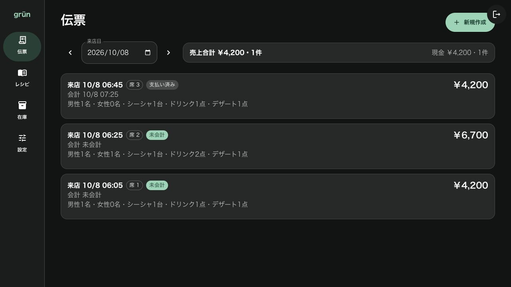
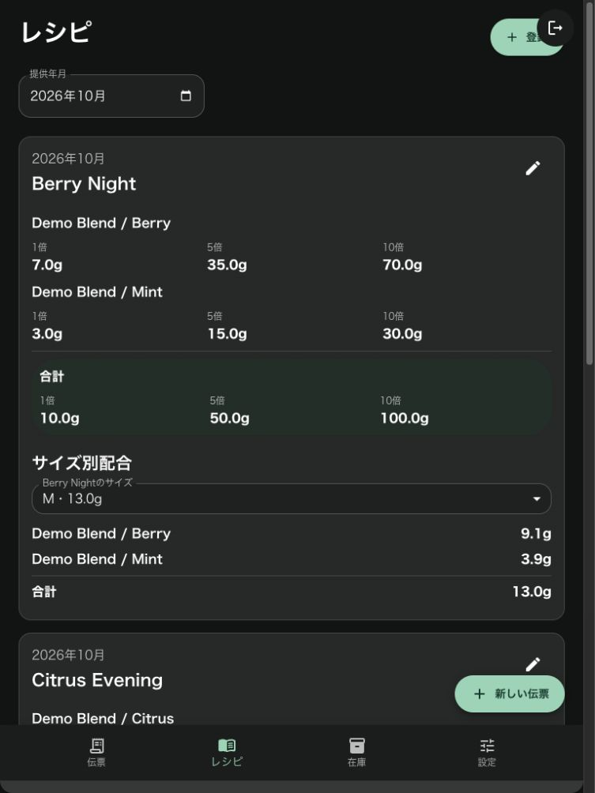
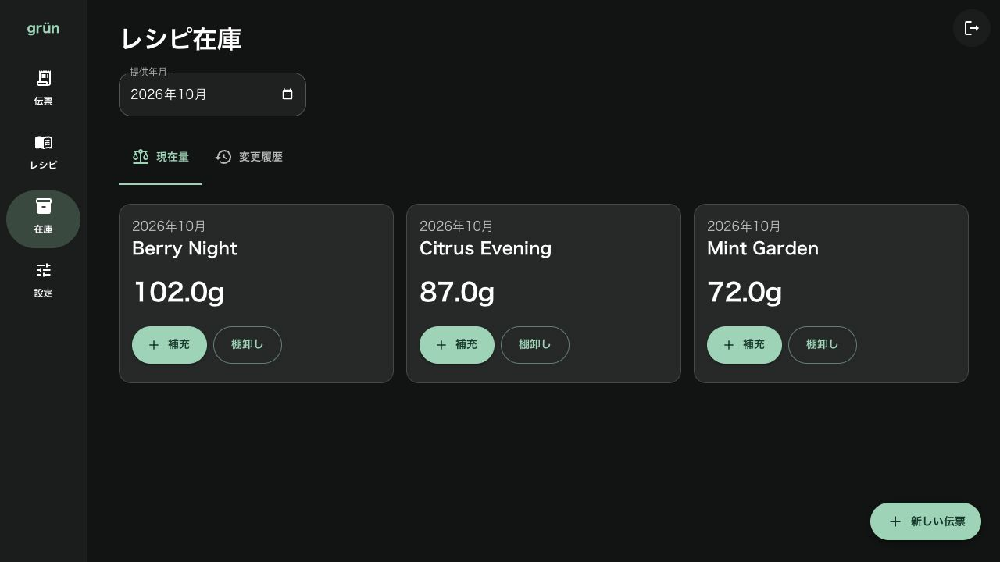

# grun — 店舗で使う伝票・レシピ・在庫管理アプリ

伝票の作成から会計、レシピの配合確認、在庫管理までを扱うWebアプリです。Lenne Hirataが個人で制作し、画面設計とフロントエンド・バックエンドの実装に取り組んでいます。

ここで紹介する名前、金額、数量、伝票はすべてダミーデータです。

## 店舗の作業を画面につなげる

来店客の注文を伝票に記録し、会計・訂正・取消まで扱います。レシピと提供サイズを選ぶと、必要な配合量を確認できます。在庫画面では現在量、補充、棚卸し、変更履歴を扱います。

画面はiPadでの操作と、暗い店内での利用を想定しています。暗い背景に淡い緑を合わせ、金額や在庫量を大きく表示しています。

## 伝票の状態と金額を確認する

伝票一覧では席、来店時刻、会計状態、人数、注文数、金額をまとめて表示します。未会計と支払い済みを区別し、日付ごとの売上を確認できる構成です。

## 配合をタブレットで確認する

レシピ画面では基準量、5倍、10倍の配合と、サイズに応じた配合量を表示します。狭い画面では移動用のボタンが画面下部にまとまります。

次の画像はブラウザの表示幅768px、高さ1024pxで確認したものです。iPad実機で撮影した画像ではありません。

## 在庫の量と変更を追う

在庫一覧では、レシピごとの残量を表示し、その場で補充や棚卸しに進めます。伝票に記録した提供量を在庫と結び付け、訂正や取消も扱う設計です。

## 実装と今回の確認

フロントエンドは React、TypeScript、Material UI、バックエンドは Python、FastAPI、Pydantic、SQLAlchemy を使っています。

紹介用の環境では、運用データベースと分けたSQLiteにダミーデータを作成しました。伝票3件、レシピ3件、会計処理と在庫の取得が成功し、一覧・レシピ・在庫画面の表示を確認しています。これは紹介画面の確認で、実店舗での操作時間短縮や使いやすさを測定した結果ではありません。

ソースリポジトリは非公開です。デザインとWebアプリの実装については [LinkedIn](https://www.linkedin.com/in/lenne-hirata-481787185/) または [メール](mailto:len.hirata@gmail.com) でご相談ください。

## In English

grun is my individual web application for managing store bills, recipes, and inventory. I designed and implemented the interface and application using React, TypeScript, Material UI, FastAPI, Pydantic, and SQLAlchemy.

The design supports tablet-oriented workflows and use in a dim store environment. Bills show payment status and totals; recipes show scaled ingredient amounts; inventory provides replenishment, stocktaking, and change history.

All screenshots use synthetic data in an isolated local database. The portrait view was captured at a 768 × 1024 browser viewport, not on a physical iPad. The source repository remains private. Measured usability or operational efficiency improvements are not claimed.
